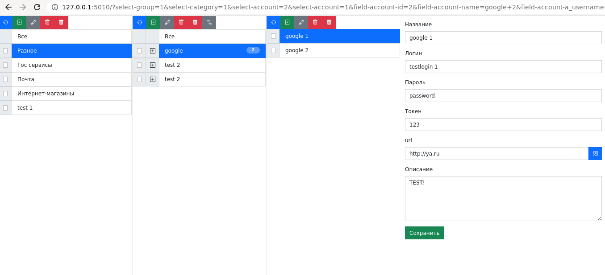

# wapp_password_manager_flask

Менеджер паролей на flask.



## Как делается релиз

1. Меняем версию, если требуется

```bash
echo 'v0.3' > VERSION
```

2. Выполняем скрипт релиза

- `pyinst` сборка pyinstaller
- `zipapp` сборка zipapp
- `all` для всех

```bash
./release-code.sh all
```

В результате коммитется текущий код и дается тэг текущей версии.
Создается релиз.
После упаковывается проект и прикрепреляется к релизу.